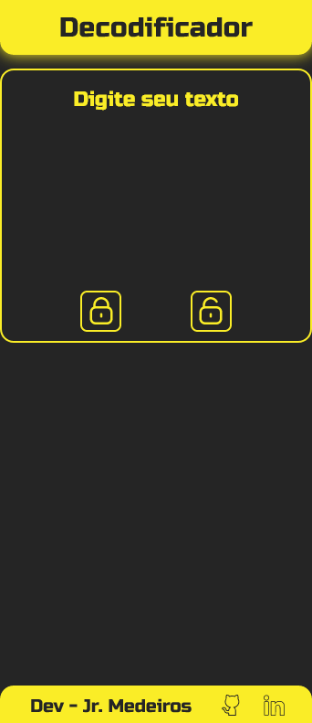

# Projeto Alura Modificado
Com base no aprendizado que fiz durante a Trilha de Formação Iniciante em Programação refiz o Projeto Alura Decodificador, alterando o resultado e a interface para torna-lo mais minimalista e funcional.
 

## Alterações Futuras
- [ ] Implementar Responsividade;
- [ ] Novos Modos para alteração do tema;

## Link do Github Pages
<a href="https://medeiros000.github.io/ProjetoAluraModificado/" target="_blank">Projeto Alura Modificado</a>
